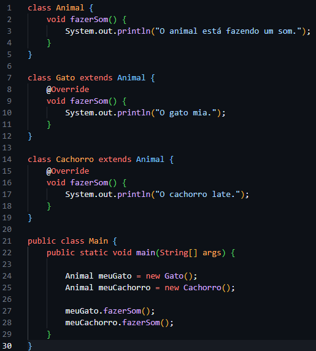

# Parte 1 - Java
- Pesquisar e elaborar um resumo sobre o Java e suas principais versões.
    - A linguagem de programação Java foi criada por James Gosling em 1991
    - a empresa responsável pelo Java antes e depois de 2010 é a  Sun Microsystems
    - O Java foi originalmente projetado como uma linguagem de programação para dispositivos eletrônicos, mas rapidamente evoluiu para ser utilizado em aplicações web e sistemas corporativos.
    - aqui estão algumas das principais versões do Java:
      - Java 8
        Introduziu novos recursos como Lambda Expressions, novos métodos e tipos, que deixaram os códigos mais enxutos . . . .
      Java 17
        Aprimorou as classes e interfaces seladas, simplificou comparações complexas e trouxe mais expressividade ao código .
      Java 18
        Padronizou o conjunto de caracteres com o UTF-8 e inseriu a anotação @Snippet documentar o código fonte . . . . . . . . . 
      Java 22
        Melhorou o desempenho, a estabilidade e a segurança . . . . . . . . . . . . . . . . . . . . . . .
        . . . . . . . . . . . . . . . . . . . . . . . . . . . . . . . . . . . 
      Java 23
        Melhora o desempenho, a estabilidade e a segurança do desenvolvimento de aplicações 
# Parte 2 - IDEs
- Conhecer as principais ferramentas utilizadas para programar em Java.
    - as principais IDEs para desenvolver com Java são: 
        - Visual Studio Code: fornece suporte avançado para o desenvolvimento de JavaScript, usando JavaScript diretamente e também usando o TypeScript
        - IntelliJ IDEA: Um dos IDEs mais populares, com recursos avançados e integração com frameworks como Spring e Hibernate 
        - NET Beans: Uma boa escolha para iniciantes, com um design intuitivo e ferramentas para desenvolvimento de aplicações desktop
    - eu escolheria o VSCode para codar porque eu já estou acostumado com a IDE, e não vejo uma diferença muito grande a ponto de me fazer trocar
# Parte 3 - POO
- Compreender o paradigma POO e sua aplicação no Java.
    - Classe: definição formal dos atributos e métodos que compõem os objetos
    - Objeto: instância de uma classe
    - Encapsulamento: reduz o acesso de uma variável ou método
    - Herança: classes filhas herdam atributos, métodos, etc. de classes mãe
    - Polimorfismo: permite que um método ou função tenha diferentes comportamentos dependendo do contexto
    - um exemplo de todos esses conceitos: 

# Parte 4 - Java DEVs
- Explorar as oportunidades e exigências da área.
    - salário médio de um desenvolvedor Java:
      - Júnior -  R$ 3.445,50
      - Pleno -  R$ 8.250
      - Sênior -  Entre R$ 7.000 e R$ 10.808
    - cinco áreas onde o Java é amplamente utilizado:
      - Desenvolvimento Web (Back-end)
      - Desenvolvimento de Aplicativos Móveis (Android)
      - Desenvolvimento de Sistemas Corporativos (Enterprise)
      - Desenvolvimento de Software para Big Data
      - Desenvolvimento de Software Financeiro e Bancário
    - cinco tecnologias ou frameworks exigidos pelas empresas para programadores Java.
      - Spring
      - Hibernate
      - JavaServer Faces
      - Apache Kafka
      - JUnit